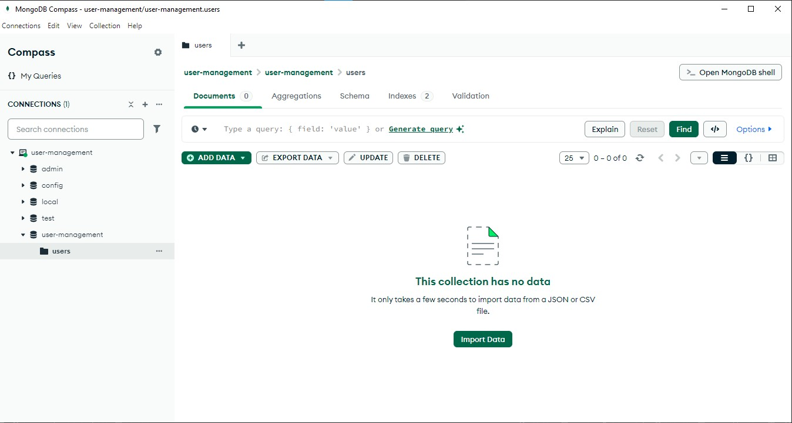

User Management API

Description
This project is a User Management API built using Node.js, Express, and MongoDB. It provides CRUD operations to manage users and includes role-based access control (isAdmin, isSeller, isCustomer). The API ensures input validation using middleware and interacts with MongoDB using Mongoose.

Features
Create User: Add a new user to the database.
Read User Details: Retrieve all users or a specific user's details.
Update User Information: Modify user information such as name, email, roles, etc.
Delete User: Remove a user from the database.
Role-Based Access Control: Store roles (isAdmin, isSeller, isCustomer) for each user.

Technologies Used
Node.js: Backend runtime environment
Express.js: Web framework
MongoDB: NoSQL database
Mongoose: MongoDB object modeling tool
Joi: Input validation library
Postman: API testing tool

Prerequisites
Ensure you have the following installed:
Node.js (v14 or higher)
MongoDB (running locally or remotely)

Steps to Run the Project
Clone the repository:
git clone https://github.com/utsabnandi/Blue-Medix-Backend_Task1-UserManagementAPI.git
cd user-management-api

Install dependencies:
npm install

Start the server:
npm run dev

Open MongoDB Compass and connect to mongodb://localhost:27017.

Use Postman to test the API endpoints.

API Endpoints
1. Create User (POST)

2. Get All Users

3. Get User by ID

4. Update User

5. MongoDB Before Deletion

6. MongoDB After Deletion

